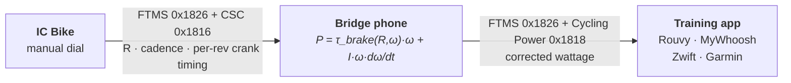

# IC Bridge

If you ride a Schwinn IC8/IC4 (or rebadged Bowflex C6/C7) and pair it
to Rouvy, MyWhoosh, Zwift, or Garmin, the broadcast power numbers can
be way off, and inconsistently so. Some riders see an exact match
against a crank meter, others see 50–100 W gaps in the same zones.
IC Bridge is a small Flutter app that reads the bike's BLE output,
applies a physics-based correction, and re-broadcasts the result as a
virtual FTMS power meter your training apps can pair to.

## Why use this

- **Steady-state power across the whole dial, not a flat offset.** The bike's broadcast formula uses cad^1.5 and R^0.83 — both wrong for an eddy-current brake. Real eddy physics gives a quadratic cadence dependence in the linear regime and a saturating brake-curve in R. On the reference unit the bike under-reads at low R (recovery and warm-up zones look harder than they are) and over-reads at high R (race-pace zones look easier). The bridge replaces both with the correct shape.
- **Honest power during accelerations.** When you stand up and surge from 80 → 110 rpm, your real input includes spinning up the 18 kg flywheel — typically an extra 100–150 W on top of the steady term. The bike ignores this entirely (its formula sees only the current cadence and R) so your surges look weak. The bridge adds the kinetic-energy term `I·ω·dω/dt` and the surge reads at full value.
- **Honest power during coastdowns, recoveries, and interval transitions.** When you stop pushing, the bike keeps reporting `R × cad^1.5` even though you're not doing work. The bridge subtracts the kinetic energy flowing *out* of the flywheel into the brake, so power drops to zero on time. Intervals, hard-to-easy transitions, and standing-to-seated changes all read right.
- **Crank-precision cadence.** The bridge reads the bike's CSC characteristic (per-revolution counts timed to 1/1024 s) on top of the noisier 1 Hz FTMS cadence field. The KE term needs `dω/dt`, so timing precision matters during fast transients.
- **Calibrates to your bike's drivetrain.** Auto-calibrate (Settings → Auto-calibrate) measures your residual drivetrain drag in 5–10 minutes of seated coastdowns. If you have an outdoor power meter, the Power scale slider pins the absolute scale against ground truth.
- **No firmware mods, standard FTMS out.** The bike doesn't change. The bridge re-broadcasts as a standard FTMS power meter, so any training app that pairs to FTMS works.
- **Production-grade plumbing.** Auto-reconnect with backoff if the BLE link drops, wakelock so the bridge phone stays awake, and an FTMS Control Point stub that politely tells apps "manual brake, no ERG/sim" so they fall back to power-only mode cleanly.

## Supported models

The Schwinn IC8 (UK/EU), IC4 (US), and Bowflex C6/C7 are the same
underlying hardware. The defaults shipped in the app were fitted on
an IC8 and apply directly.

| Model                    | Status                                          |
|--------------------------|-------------------------------------------------|
| **Schwinn IC8 / IC4**    | Reference platform. Ships calibrated.           |
| **Bowflex C6 / C7**      | Same hardware. Ships calibrated.                |
| Other FTMS indoor bikes  | Should work if they broadcast resistance over FTMS. Run Auto-calibrate first, then verify scale against an outdoor power meter if you have one. |

## What the bridge does



The bridge reads two BLE services from the bike: **FTMS Indoor Bike Data** (cadence, resistance level, the bike's own power estimate) and **CSC Cycling Speed and Cadence** (per-revolution crank counts and event times). It runs the physics correction on every sample, then advertises itself as a virtual FTMS bike + cycling power meter named **"IC Bike (corrected)"** (configurable in Settings). Your training app pairs to the bridge instead of the bike.

Heart rate is handled the usual way — pair your HR strap directly to your training app. The bridge doesn't try to be a HR proxy.

There's no resistance control. The bike has a manual dial, so ERG mode isn't possible regardless of what you pair it to.

## Build and run

```
cd bridge
flutter pub get
flutter run                      # connect a phone first
```

In the app: if a Bluetooth icon appears in the top bar, tap it to
grant permissions, then tap **Find bike**, tap your bike, and the
bridge starts. From your training app on a separate device, pair to
**"IC Bike (corrected)"** as a power meter and as an FTMS bike.

If your numbers feel off, open Settings → **Auto-calibrate** to fit
your bike's drivetrain residual drag (5–10 minutes, on-device). If
you have an external power meter, use the **Power scale** slider on
the same screen to pin the absolute scale. Default is 100% — the
shipped constants already absorb the known offsets on the reference
unit.

Tests live in `bridge/test/`. `flutter test` should pass after any
default changes.

## Limitations

- **Absolute scale depends on your unit.** Spin-downs alone can't tell brake strength from flywheel inertia apart (they multiply in the physics). We pin both from the reference IC8 — geometry for inertia, the 1000 W max-output spec for brake strength. Another IC8 with different manufacturing tolerances could still land 10% off; the Power scale slider absorbs that, but pinning it requires an external power meter.
- **High-cadence cap.** The IC8 saturates broadcast cadence at 125 rpm. Above the cap, the bridge falls back to CSC-derived cadence; if CSC isn't available it clamps and slightly underestimates power at very high rpm.
- **Bell-curve onset is physics-anchored, not data-anchored.** Our spin-downs sit mostly in the linear-damping regime, so the saturating roll-off at the highest R values is fixed by classical eddy-brake theory rather than directly observed. Disambiguating it would need either an independent magnetic-field measurement or coastdowns from much higher peak cadence.

---

## Why the bike's numbers can't be trusted

The IC8 broadcasts power as a function of cadence and the resistance
dial:

$$P_{\text{IC8}} \approx 0.019 \cdot R^{0.83} \cdot \text{cad}^{1.5}$$

Both exponents are wrong. Real eddy-current physics gives $P \propto \omega^2$ in the linear regime, not $\text{cad}^{1.5}$, and the absolute scale isn't fixed — it drifts unit-to-unit and across the dial. That's why forum reports disagree about whether the bike reads high or low.

The shape of the gap is consistent though. Dashed lines are what the bike broadcasts, solid lines are what the bridge re-broadcasts:


The two curves cross around $R \approx 45$ at moderate cadences. Below that the bridge reads lower than the bike, above it the bridge reads higher. The exact crossover depends on your unit; the **Power scale** slider pins it against an external reference.

## The fix

The IC8 is a permanent-magnet eddy brake on an aluminum disc. Classical Wouterse / Smythe / Wiederick theory gives the brake torque as a bell curve in $\omega$ — linear below the critical speed $\omega_c$, falling above it as induced eddy currents partially cancel the source flux:

$$\tau_{\text{brake}}(R,\omega) = \tau_{\max}(R) \cdot \frac{2(\omega/\omega_c(R))}{1 + (\omega/\omega_c(R))^2}$$

Add the kinetic-energy term that matters during accelerations:

$$P_{\text{corrected}} = \tau_{\text{brake}}(R,\omega) \cdot \omega + I\,\omega\,\dot\omega$$

At steady cadence the second term is zero. During an acceleration it adds the work spent spinning up the flywheel; during a coastdown it subtracts.

### Where the constants come from

**Brake curve from spin-downs.** Strict Wouterse pins both $\tau_{\max}(R)$ and $\omega_c(R)$ to a single underlying $B^2(R)$, via $\tau_{\max} \propto B^2$ and $\omega_c \propto 1/B^2$. We parameterize $B^2(R)$ with a Hill curve:

$$H(R) = \frac{R^p}{R^p + R_h^p}, \quad \tau_{\max}(R) = \alpha\,H(R), \quad \frac{1}{\omega_c(R)} = \kappa\,H(R)$$

Fit by integrating $I\,\dot\omega = -\tau_{\text{brake}} - I\,\beta\,\omega$ against $\omega(t)$ of every spin-down (46 video-tracked segments spanning $R = 0$ to 93; `analysis/fit_wouterse.py`):

- $\alpha = 165$ N·m, $\beta = 0.0389$ s⁻¹, $\kappa = 0.162$ s/rad, $R_h = 72.9$, $p = 1.27$.
- $\alpha/\kappa = 1020$ W — the strict-Wouterse asymptotic peak brake power, within 2% of the manufacturer's 1000 W max-output spec.


$R_h$, $p$, and $\kappa$ entangle eddy-brake physics with the IC8 firmware's dial-to-magnet mapping, so they ship as fixed defaults. Auto-calibrate refits only $\beta$ against the linear-regime collapse $\lambda_{\text{eff}}(R) = \beta + (2\alpha\kappa/I) \cdot H(R)^2$. $\alpha$ and $I_{\text{crank}}$ are structurally degenerate in spin-down data — only their ratio appears in $I\,\dot\omega = -\tau$ — so per-bike $\alpha$ fitting would just absorb any $I_{\text{crank}}$ deviation into a wrong $\alpha$. Absolute scale is the Power scale slider's job.

**Inertia from flywheel geometry, no fitting.** The 18 kg flywheel is a uniform 5 mm Al disc ($R = 23$ cm) with two lead weight-rings measured by ruler:

- Disc ($\rho_{\text{Al}} = 2700$): 2.24 kg, $I = 0.059$ kg·m².
- Ring A ($r$ from 13.5 to 18.5 cm, $h \approx 1.77$ cm, $\rho_{\text{Pb}} = 11{,}340$): 10.09 kg, $I = 0.265$ kg·m².
- Ring B ($r$ from 13.0 to 17.0 cm, $h \approx 1.33$ cm, same density): 5.67 kg, $I = 0.130$ kg·m².

Lead is the only material that closes the mass budget at the measured ring volumes — iron, brass, copper, and even bismuth all need rings thicker than the measured upper bounds (iron by 27%). With gear ratio $g = 4.5$, $I_{\text{crank}} = g^2 \cdot I_{\text{flywheel}} = 9.19$ kg·m². Disc and rings sit at similar effective radii, so $I_{\text{crank}}$ is insensitive to how mass redistributes between them (robust to ~10%).

These three anchors — disc geometry, ring geometry, and the 1000 W max spec — are independent. They land on a calibration self-consistent with both the data (RSS = 0.0431 across 51,792 samples) and the bike's design specs.

The in-app **Power scale** slider scales $\alpha$ and $I_{\text{crank}}$ together, so steady-state, residual drag, and the KE term all move in lockstep. Default 1.0; tune against an external power meter when one is available.

## Reality check: the model decomposes an acceleration cleanly

A BLE-logged acceleration at $R = 25$. Cadence climbs from 24 to 118 rpm
over ~10 seconds (briefly hitting the FTMS 125-rpm cap), then the
rider stops pushing and the flywheel coasts back down to ~50 rpm:


Blue area is the steady term $\tau_{\text{brake}}(R,\omega)\,\omega$, red area is the KE term $I\,\omega\,\dot\omega$. KE adds ~135 W on top of the ~300 W steady at the peak of the ramp, then flips negative during the coastdown so total power drops to near zero (the rider has stopped pushing, the flywheel is bleeding off its kinetic energy into the brake). The same shape shows up on a 4iiii crank meter during an outdoor acceleration: different sensor, different system, same physics.

## Repository layout

```
bridge/                          Flutter app, the bridge itself
bridge/lib/ble/                  BLE central + peripheral
bridge/lib/physics/              corrector + Wouterse coastdown fit
                                 (what Auto-calibrate runs on-device)
analysis/parse_nrf_log.py        nRF Connect log -> CSV (FTMS + CSC joined)
analysis/decode_ftms.py          FTMS Indoor Bike Data parser
analysis/decode_csc.py           CSC measurement parser
analysis/track_crank.py          per-frame crank-angle PCA tracker on a
                                 spindown video (mod-π output)
analysis/extract_spindowns_from_video.py  segments active runs in a tracked
                                          crank-angle video
analysis/spindown_fit_video.py   per-segment exponential decay fit on raw
                                 mod-π crank angles
analysis/curate_spindowns.py     interactive in/out-marker tool over the
                                 video coastdown candidates
analysis/aggregate_spindowns.py  merges curated bounds into one per-rev ω(t)
                                 dataset (data/calibration/all_spindowns.csv)
analysis/fit_wouterse.py         strict-Wouterse 5-param fit on the curated
                                 dataset (one-shot trajectory ODE fit)
analysis/plot_readme_figures.py  regenerates power_curves.png and
                                 indoor_surge.png from the bridge defaults
                                 + the canonical R=25 acceleration BLE log
data/calibration/                BLE logs + crank videos used to fit defaults
docs/figures/                    README plots
```
