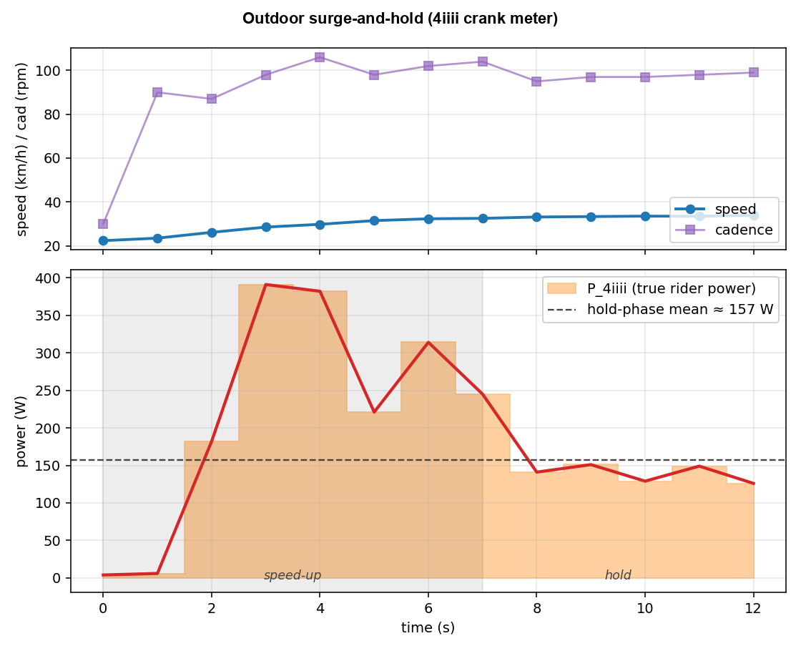

# IC Bridge

If you ride a Schwinn IC8/IC4 (or rebadged Bowflex C6/C7) and pair it
to Rouvy, MyWhoosh, Zwift, or Garmin, the broadcast power numbers can
be way off. Some riders see an exact match against a crank meter,
others see 50–100 W gaps in the same zones.
IC Bridge is a small Flutter app that reads the bike's BLE output,
applies a physics-based correction, and re-broadcasts the result as a
virtual FTMS power meter your training apps can pair to.

## What the bridge does


The bridge reads two BLE services from the bike: **FTMS Indoor Bike Data** (cadence, resistance level, the bike's own power estimate) and **CSC Cycling Speed and Cadence** (per-revolution crank counts and event times). It runs the physics correction on every sample, then advertises itself as a virtual FTMS bike + cycling power meter named **"IC Bike (corrected)"** (configurable in Settings). Your training app pairs to the bridge instead of the bike.

Heart rate works the usual way: pair your strap directly to your training app. The bridge isn't a HR proxy.

There's no resistance control. The bike has a manual dial, so ERG mode isn't possible regardless of what you pair to.

## Why use this

- **Right shape across the resistance range.** The bike's formula uses cad^1.5 and R^0.83 (R is the resistance dial). The actual eddy-current physics is quadratic in cadence and saturates in R. On the reference unit the bike reads low at low R (warm-ups feel harder than they are) and high at race-pace R.
- **Honest power during accelerations.** When you stand up and surge from 80 to 110 rpm, you're also spinning up an 18 kg flywheel. That's an extra 100–150 W the bike doesn't see. The bridge adds the kinetic-energy term `I·ω·dω/dt` so the surge reads at full value.
- **Honest power during coastdowns and recoveries.** When you stop pushing, the bike keeps reporting `R × cad^1.5`. The bridge subtracts the kinetic energy flowing out of the flywheel into the brake, so power drops to zero on time.
- **Crank-precision cadence.** The bridge reads the bike's CSC characteristic (per-revolution counts timed to 1/1024 s) on top of the noisier 1 Hz FTMS cadence field, which sharpens the acceleration math during fast transients.
- **Calibrates to your bike's drivetrain.** Auto-calibrate (Settings → Auto-calibrate) takes 5–10 minutes: pedal up to at least 70 rpm, lift both feet off so the pedals spin freely, wait for them to stop, then change the resistance and repeat — at least 3 different resistance levels. It fits your residual drivetrain drag from the resulting flywheel-decay curves. With an outdoor power meter, the Power scale slider pins the absolute scale against ground truth.
- **Standard FTMS out, no firmware mods.** The bridge re-broadcasts as a standard FTMS power meter, so any training app that pairs to FTMS works. The bike doesn't change.
- **Production-grade plumbing.**
  - Auto-reconnect with backoff if the BLE link drops.
  - Wakelock keeps the bridge phone awake.
  - The bridge advertises a manual brake (no ERG/sim) so training apps cleanly fall back to power-only mode.

## Supported models

The Schwinn IC8 (UK/EU), IC4 (US), and Bowflex C6/C7 are the same
underlying hardware. The defaults shipped in the app were fitted on
an IC8 and apply directly.

| Model                    | Status                                          |
|--------------------------|-------------------------------------------------|
| **Schwinn IC8 / IC4**    | Reference platform. Ships calibrated.           |
| **Bowflex C6 / C7**      | Same hardware. Ships calibrated.                |
| Other FTMS indoor bikes  | Should work if they broadcast resistance over FTMS. Run Auto-calibrate first, then verify scale against an outdoor power meter if you have one. |

## Build and run

```
cd bridge
flutter pub get
flutter run --release            # connect a phone via USB first; --release so the app keeps running after you unplug
```

In the app: if a Bluetooth icon appears in the top bar, tap it to
grant permissions, then tap **Find bike**, tap your bike, and the
bridge starts. From your training app on a separate device, pair to
**"IC Bike (corrected)"** as a power meter and as an FTMS bike.

If your numbers feel off, open Settings → **Auto-calibrate** to fit
your bike's drivetrain drag (5–10 minutes, on-device). If you have
an external power meter, use the **Power scale** slider on the same
screen to pin the absolute scale. Default is 100%.

## Limitations

- **Absolute scale depends on your unit.** Spin-downs can't disentangle brake strength from flywheel inertia, so we pin both from the reference IC8 (geometry for inertia, the 1000 W max-output spec for brake strength). Another unit with different manufacturing tolerances could still be off by 10%. The Power scale slider absorbs that against an external power meter.
- **High-cadence cap.** The IC8 saturates broadcast cadence at 125 rpm. Above the cap, the bridge falls back to CSC-derived cadence. Without CSC it clamps and slightly underestimates power at very high rpm.
- **Roll-off at the highest R values is theory, not data.** Our spin-downs sit mostly in the linear-damping regime where the brake is roughly linear in cadence. The saturating roll-off above that is pinned by classical eddy-brake theory (see "The fix" below) rather than fitted to our measurements.

---

## Why the bike's numbers can't be trusted

The IC8 broadcasts power as a function of cadence and the resistance
dial:

$$P_{\text{IC8}} \approx 0.019 \cdot R^{0.83} \cdot \text{cad}^{1.5}$$

Both exponents are wrong. Real eddy-current physics gives $P \propto \omega^2$ in the linear regime, not $\text{cad}^{1.5}$, and the absolute scale drifts unit-to-unit and across the dial. That's why forum reports disagree about whether the bike reads high or low.

The shape of the gap is consistent though. Dashed lines are what the bike broadcasts, solid lines are what the bridge re-broadcasts:


The two curves cross around $R \approx 45$ at moderate cadences. Below that the bridge reads lower than the bike, above it the bridge reads higher. The exact crossover depends on your unit; the **Power scale** slider pins it against an external reference.

## The fix

The IC8 is a permanent-magnet eddy brake on an aluminum disc. Classical Wouterse / Smythe / Wiederick theory gives the brake torque as a bell curve in $\omega$, linear below the critical speed $\omega_c$ and falling above it as induced eddy currents partially cancel the source flux:

$$\tau_{\text{brake}}(R,\omega) = \tau_{\max}(R) \cdot \frac{2(\omega/\omega_c(R))}{1 + (\omega/\omega_c(R))^2}$$

Add the kinetic-energy term that matters during accelerations:

$$P_{\text{corrected}} = \tau_{\text{brake}}(R,\omega) \cdot \omega + I\,\omega\,\dot\omega$$

At steady cadence the second term is zero. During an acceleration it adds the work spent spinning up the flywheel; during a coastdown it subtracts.

### Where the constants come from

**Brake curve from spin-downs.** Strict Wouterse pins both $\tau_{\max}(R)$ and $\omega_c(R)$ to a single underlying $B^2(R)$, via $\tau_{\max} \propto B^2$ and $\omega_c \propto 1/B^2$. We parameterize $B^2(R)$ with a sum of two Hill curves:

$$H(R) = w \cdot \frac{R^{p_1}}{R^{p_1} + R_{h1}^{p_1}} + (1-w) \cdot \frac{R^{p_2}}{R^{p_2} + R_{h2}^{p_2}}, \quad \tau_{\max}(R) = \alpha\,H(R), \quad \frac{1}{\omega_c(R)} = \kappa\,H(R)$$

A single 2-param Hill over-brakes by 0.3–0.85 rad/s across $R = 22..44$ in the middle of the spin-down — the empirical $B^2(R)$ has a shoulder a single sigmoid can't bend to. Two Hills close that mid-band gap, dropping global RSS 38% over the single-Hill fit. The decomposition is empirical: the IC8 has two magnet pairs but both engage over the same $R$ range and already sum to a smooth ramp in the geometric $H_\mathrm{geom}$ (`analysis/physics_first_brake.py`, `analysis/fit_geom_hill.py`), so the second Hill captures structure plausibly from yoke flux saturation, anti-polar pair coupling, or $\sigma_\mathrm{Al}$ frequency dependence — but isn't a clean one-knob mapping to any of those.

Fit by integrating $I\,\dot\omega = -\tau_{\text{brake}} - \tau_c - I\,\beta\,\omega$ against $\omega(t)$ of every spin-down. Residual drag is split into a constant Coulomb term $\tau_c$ (bearings + belt + seal friction) and a linear viscous term $I\,\beta\,\omega$ (windage + air-film); isolating the $R=0$ spin-downs and fitting drag-shape alone, Coulomb + viscous beats viscous-only by roughly 15× in RSS, which matches physical expectation (bearings give approximately constant torque, not viscous). The 1 Hz BLE cadence is too coarse to fit a curve to during a fast decay, so $\omega(t)$ comes from 120 fps phone video of the cranks (46 segments spanning $R = 0$ to 93; `analysis/track_crank.py`, `analysis/fit_wouterse.py`):

- $\alpha = 165$ N·m, $\beta = 0.0157$ s⁻¹, $\tau_c = 1.36$ N·m, $\kappa = 0.1585$ s/rad.
- $w = 0.447$; sharp Hill $R_{h1} = 57.6$, $p_1 = 2.30$; broad Hill $R_{h2} = 128$, $p_2 = 0.685$.
- $\alpha/\kappa = 1041$ W, the strict-Wouterse asymptotic peak brake power. Within 4% of the manufacturer's 1000 W max-output spec.


The H-shape constants ($w, R_{h1}, p_1, R_{h2}, p_2$), $\kappa$, and $\tau_c$ entangle eddy-brake physics, the IC8 firmware's dial-to-magnet mapping, and bearing/belt friction, so they ship as fixed defaults. $\kappa$ in particular is pinned at the previous single-Hill optimum so that letting the H-shape stretch freely doesn't shrink $\kappa$ to keep $\alpha\kappa H^2$ matched in the linear regime — which would silently break the 1000 W anchor. Auto-calibrate refits only $\beta$ against the linear-regime collapse $\lambda_{\text{eff}}(R) = \beta + (2\alpha\kappa/I) \cdot H(R)^2$; the per-bike $\beta$ silently absorbs any unit-to-unit drift in $\tau_c$ as a small bias (~5–10% of $\lambda$ at typical riding cadences). $\alpha$ and $I_{\text{crank}}$ are structurally degenerate in spin-down data (only their ratio appears in $I\,\dot\omega = -\tau$), so per-bike $\alpha$ fitting just absorbs $I_{\text{crank}}$ deviations into a wrong $\alpha$. Absolute scale is the Power scale slider's job.

**Inertia from flywheel geometry, no fitting.** The 18 kg flywheel is a uniform 5 mm Al disc ($R = 23$ cm) with two lead weight-rings measured by ruler:

- Disc ($\rho_{\text{Al}} = 2700$): 2.24 kg, $I = 0.059$ kg·m².
- Ring A ($r$ from 14 to 18 cm, $h \approx 2.03$ cm, $\rho_{\text{Pb}} = 11{,}340$): 9.25 kg, $I = 0.241$ kg·m².
- Ring B ($r$ from 13 to 17 cm, $h \approx 1.52$ cm, same density): 6.50 kg, $I = 0.149$ kg·m².

Each belt has ~2-3 mm chamfered edges extending past the flat-top radii above (the chamfer cuts the corner, not all the way to zero thickness); the chamfer volume closes the 18 kg budget at flat-top $h$ comfortably within the ruler "less than" bounds, and the symmetric chamfers shift $I$ by <0.3% (below the flat-ring formula's precision). Lead is the only material consistent with the measured ring volumes and the 18 kg total: iron, brass, copper, and bismuth all need rings far thicker than the bounds allow (iron by 46%, brass 35%, copper 28%, bismuth 18%). With gear ratio $g = 4.5$, $I_{\text{crank}} = g^2 \cdot I_{\text{flywheel}} = 9.09$ kg·m².

Disc and ring geometry pin $I$ from physics; spin-downs pin the linear-regime damping $2\alpha\kappa H^2/I$, the H-shape, and both residual-drag terms; the 1000 W spec pins the remaining $\alpha/\kappa$ degree of freedom. The fit lands at RSS = 0.0209 across 51,792 samples — a 38% improvement over the earlier single-Hill calibration, which itself was 21% better than the viscous-only precursor.

The 1000 W anchor is the soft one — it's a marketing/regulatory ceiling, not a measurement. A ±30% error in $\alpha$ distorts predicted power by a few percent at warm-up R, growing to roughly $-22\%$ / $+12\%$ at high R (`analysis/alpha_sensitivity.py`). The Power scale slider absorbs a uniform multiplier but not the R-shape distortion. An independent $\alpha$ — Hall-probe $B$ fed into the Wouterse linear-regime formula (`analysis/physics_first_brake.py`) — would close the gap; without it, ground-truth absolute scale at high R needs an external power-meter sweep across multiple R levels.

The in-app **Power scale** slider scales $\alpha$ and $I_{\text{crank}}$ together, so steady-state, residual drag, and the KE term move in lockstep. Default 1.0; tune against an external power meter when one is available.

## Reality check: the model decomposes an acceleration cleanly

A BLE-logged acceleration at $R = 25$. Cadence climbs from 24 to 118 rpm
over ~10 seconds (briefly hitting the FTMS 125-rpm cap), then the
rider stops pushing and the flywheel coasts back down to ~50 rpm:


Blue area is the steady term $\tau_{\text{brake}}(R,\omega)\,\omega$, red area is the KE term $I\,\omega\,\dot\omega$. KE adds ~135 W on top of the ~300 W steady at the peak of the ramp, then flips negative during the coastdown so total power drops to near zero (the rider has stopped pushing, the flywheel is bleeding off its kinetic energy into the brake).

The same shape shows up on a 4iiii crank meter during an outdoor acceleration. Different sensor, different system, same physics:



## Repository layout

```
bridge/            Flutter app (the bridge itself)
  lib/ble/           BLE central + peripheral
  lib/physics/       corrector + Wouterse coastdown fit
                     (what Auto-calibrate runs on-device)
analysis/          Calibration pipeline (Python): nRF Connect log → CSV
                   → video crank tracking → spin-down curation →
                   strict-Wouterse ODE fit. Also ic8_logger.py for raw
                   BLE capture, plot_readme_figures.py for the README
                   figures, and physics_first_brake.py for an independent
                   geometry-only sanity check (not on the calibration
                   path). Each script documents its role in its top
                   docstring. Install deps with
                   `pip install -r analysis/requirements.txt`.
docs/figures/      README plots and the bridge data-flow diagram.
```

## License

[PolyForm Noncommercial 1.0.0](LICENSE). Free to use, modify, and share for personal, research, hobby, and other noncommercial purposes. Commercial use is not permitted.
