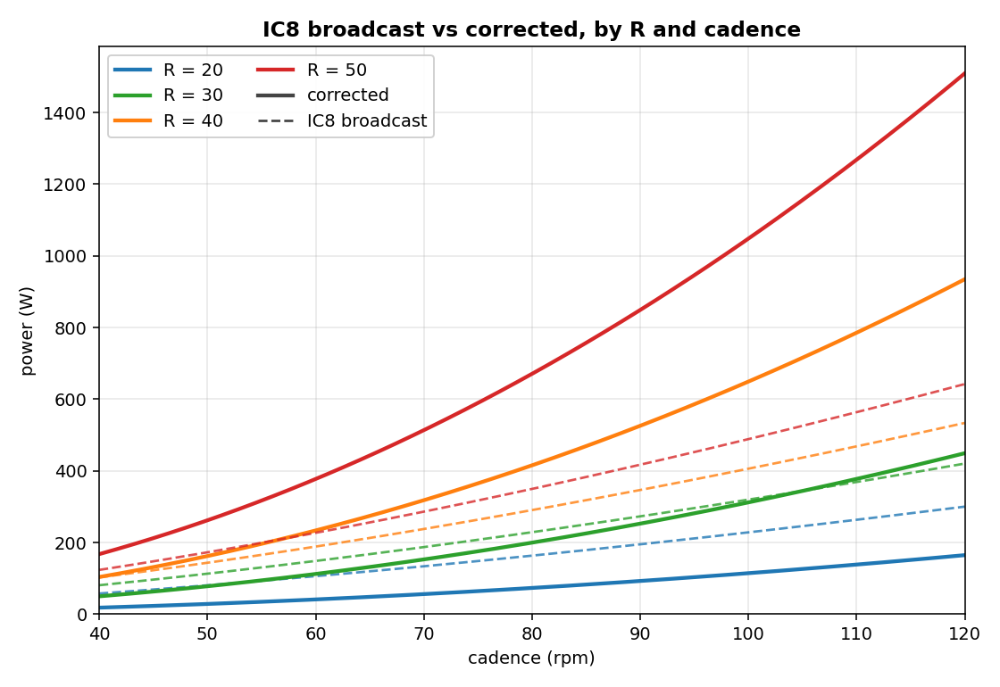
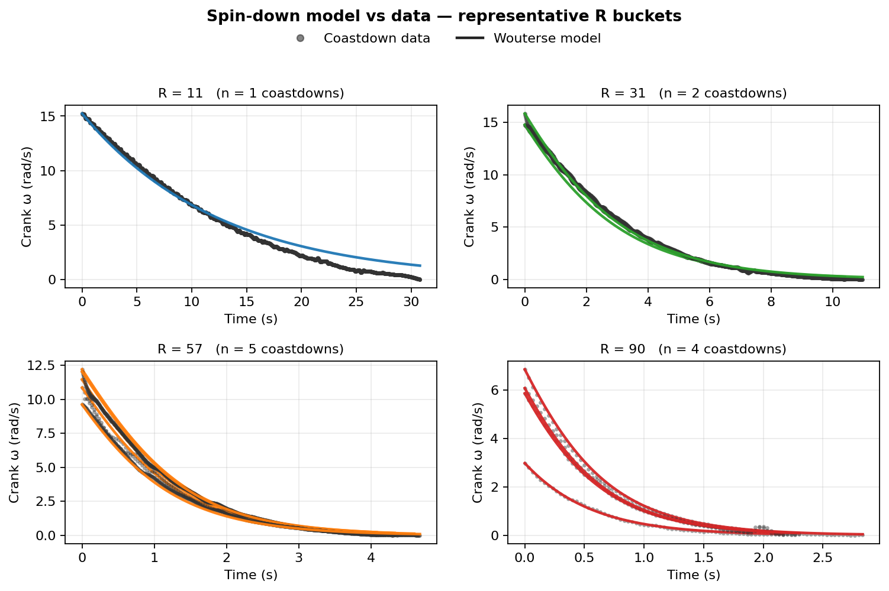
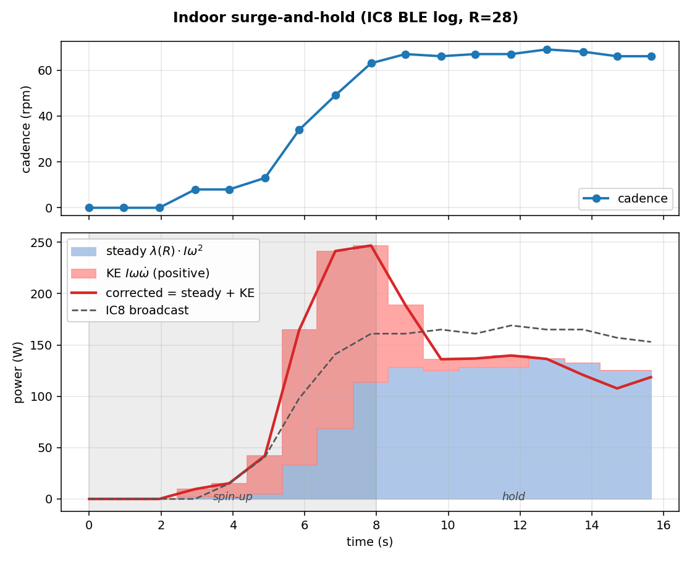

# IC Bridge

If you ride a Schwinn IC8/IC4 (or rebadged Bowflex C6/C7) and pair it
to Rouvy, MyWhoosh, Zwift, or Garmin, the broadcast power numbers can
be way off. Some riders see an exact match against a crank meter,
others see 50–100 W gaps in the same zones.
IC Bridge is a small Flutter app that reads the bike's BLE output,
applies a physics-based correction, and re-broadcasts the result as a
virtual FTMS power meter your training apps can pair to.

## What the bridge does


The bridge reads two BLE services from the bike: **FTMS Indoor Bike Data** (cadence, resistance level, the bike's own power estimate) and **CSC Cycling Speed and Cadence** (per-revolution crank counts and event times). It runs the physics correction on every sample, then advertises itself as a virtual FTMS bike + cycling power meter named **"IC Bike (corrected)"** (configurable in Settings). Your training app pairs to the bridge instead of the bike.

Heart rate works the usual way: pair your strap directly to your training app. The bridge isn't a HR proxy.

There's no resistance control. The bike has a manual dial, so ERG mode isn't possible regardless of what you pair to.

## Why use this

- **Right shape across the resistance range.** The bike's formula uses cad^1.5 and R^0.83 (R is the resistance dial). The actual eddy-current physics is quadratic in cadence and saturates in R.
- **Honest power during transients.** Surging from 80 to 110 rpm spins up the flywheel — roughly 80–130 W the bike doesn't see. The bridge adds the kinetic-energy term `I·ω·dω/dt`, so surges read at full value and coastdowns drop to zero on time.
- **Crank-precision cadence.** The bridge reads the bike's CSC characteristic (per-revolution counts timed to 1/1024 s) on top of the noisier 1 Hz FTMS cadence field, which sharpens the acceleration math during fast transients.
- **Low-R drivetrain fine-tune.** Auto-calibrate (Settings → Auto-calibrate) refits the residual drivetrain drag from flywheel-decay curves — 5–10 minutes, on-device. It matters most at warm-up resistances; at race-pace R the eddy brake dominates. For absolute scale, use the Power scale slider against an external power meter.
- **Standard FTMS out, no firmware mods.** The bridge re-broadcasts as a standard FTMS power meter, so any training app that pairs to FTMS works. The bike doesn't change.

## Supported models

The Schwinn IC8 (UK/EU), IC4 (US), and Bowflex C6/C7 are the same
underlying hardware. The defaults shipped in the app were fitted on
an IC8 and apply directly.

| Model                    | Status                                          |
|--------------------------|-------------------------------------------------|
| **Schwinn IC8 / IC4**    | Reference platform. Ships calibrated.           |
| **Bowflex C6 / C7**      | Same hardware. Ships calibrated.                |
| Other FTMS indoor bikes  | Cadence + KE math will be right, but the brake shape, magnitude, and flywheel inertia are all pinned to the IC8 family. Auto-calibrate only refits β (drivetrain drag), so a bike with different brake hardware or a different flywheel will read wrong and the in-app knobs can't fix it. |

## Build and run

```
cd bridge
flutter pub get
flutter run --release            # connect a phone via USB first; --release so the app keeps running after you unplug
```

In the app: tap the Bluetooth icon in the top bar to grant
permissions if shown, then **Find bike** and tap your bike. From
your training app on a separate device, pair to **"IC Bike
(corrected)"** as both a power meter and an FTMS bike.

If warm-up power feels off, use Settings → **Auto-calibrate**
(5–10 min, on-device). For absolute scale, tune **Power scale**
against an external meter.

## Limitations

- **Absolute scale depends on your unit.** Spin-downs can't disentangle brake strength from flywheel inertia, so we pin both from the reference IC8 (geometry plus an outdoor power-meter session for inertia, the 1000 W max-output spec for brake strength). Another unit with different manufacturing tolerances could still be off by 10%. The Power scale slider absorbs that against an external power meter.
- **High-cadence cap.** The IC8 saturates broadcast cadence at 125 rpm. Above the cap, the bridge falls back to CSC-derived cadence. Without CSC it clamps and slightly underestimates power at very high rpm.
- **Roll-off at the highest R values is theory, not data.** Our spin-downs sit mostly in the linear-damping regime where the brake is roughly linear in cadence. The saturating roll-off above that is pinned by classical eddy-brake theory (see "The fix" below) rather than fitted to our measurements.

---

## Why the bike's numbers can't be trusted

The IC8 broadcasts power as a function of cadence and the resistance
dial:

$$P_{\text{IC8}} \approx 0.019 \cdot R^{0.83} \cdot \text{cad}^{1.5}$$

Both exponents are wrong. Real eddy-current physics gives $P \propto \omega^2$ in the linear regime, not $\text{cad}^{1.5}$, and the absolute scale drifts unit-to-unit and across the dial. That's why forum reports disagree about whether the bike reads high or low.

The shape of the gap is consistent though. Dashed lines are what the bike broadcasts, solid lines are what the bridge re-broadcasts:



The two curves cross around $R \approx 45$ at moderate cadences. Below that the bridge reads lower than the bike, above it the bridge reads higher. The exact crossover depends on your unit; the **Power scale** slider pins it against an external reference.

## The fix

The IC8 is a permanent-magnet eddy brake on an aluminum disc. Classical Wouterse / Smythe / Wiederick theory gives the brake torque as a bell curve in $\omega$, linear below the critical speed $\omega_c$ and falling above it as induced eddy currents partially cancel the source flux:

$$\tau_{\text{brake}}(R,\omega) = \tau_{\max}(R) \cdot \frac{2(\omega/\omega_c(R))}{1 + (\omega/\omega_c(R))^2}$$

Add the kinetic-energy term that matters during accelerations:

$$P_{\text{corrected}} = \tau_{\text{brake}}(R,\omega) \cdot \omega + I\,\omega\,\dot\omega$$

At steady cadence the second term is zero. During an acceleration it adds the work spent spinning up the flywheel; during a coastdown it subtracts.

### Where the constants come from

**Brake curve from spin-downs.** Strict Wouterse pins both $\tau_{\max}(R)$ and $\omega_c(R)$ to a single underlying $B^2(R)$, via $\tau_{\max} \propto B^2$ and $\omega_c \propto 1/B^2$. We parameterize $B^2(R)$ with a sum of two Hill curves:

$$H(R) = w \cdot \frac{R^{p_1}}{R^{p_1} + R_{h1}^{p_1}} + (1-w) \cdot \frac{R^{p_2}}{R^{p_2} + R_{h2}^{p_2}}, \quad \tau_{\max}(R) = \alpha\,H(R), \quad \frac{1}{\omega_c(R)} = \kappa\,H(R)$$

The two-Hill split is empirical — $B^2(R)$ has a mid-band shoulder that doesn't fit a single sigmoid, and the IC8's two magnet pairs engage across the same $R$ range, so the second Hill doesn't map cleanly to one of them.

Fit by integrating $I\,\dot\omega = -\tau_{\text{brake}} - \tau_c - I\,\beta\,\omega$ against $\omega(t)$ of every spin-down. Residual drag splits into a constant Coulomb term $\tau_c$ (bearings + belt + seal friction) and a viscous term $I\,\beta\,\omega$ (windage + air-film); $R=0$ spin-downs prefer that split over viscous-only by ~15× in RSS. $\omega(t)$ comes from 120 fps phone video (1 Hz BLE cadence is too coarse for a fast decay) across 46 segments spanning $R = 0$ to 93 (`analysis/track_crank.py`, `analysis/fit_wouterse.py`):

- $\alpha = 165$ N·m, $\beta = 0.0154$ s⁻¹, $\tau_c = 1.15$ N·m, $\kappa = 0.1585$ s/rad.
- $w = 0.599$; broad Hill $R_{h1} = 185.0$, $p_1 = 0.669$; sharp Hill $R_{h2} = 59.4$, $p_2 = 2.25$.
- $\alpha/\kappa = 1041$ W, the strict-Wouterse asymptotic peak brake power. Within 4% of the manufacturer's 1000 W max-output spec.



The H-shape, $\kappa$, and $\tau_c$ ship as fixed defaults — they entangle brake physics, the firmware's dial-to-magnet mapping, and bearing/belt friction in ways spin-down data alone can't separate. Auto-calibrate refits only $\beta$ against the linear-regime collapse $\lambda_{\text{eff}}(R) = \beta + (2\alpha\kappa/I) \cdot H(R)^2$. $\alpha$ and $I_{\text{crank}}$ are structurally degenerate in spin-down data (only their ratio appears in $I\,\dot\omega = -\tau$), so absolute scale is the Power scale slider's job, not auto-calibrate's.

**Inertia: flywheel geometry, then a power-meter correction.** The flywheel is a 5 mm Al disc ($R = 23$ cm, 2.24 kg) carrying two ruler-measured lead weight-rings (9.25 kg and 6.50 kg), summing to the manufacturer's 18 kg spec. The flat-ring moments give $I_{\text{flywheel}} = 0.449$ kg·m²; with measured gear ratio $g = 4.5$, the geometric prediction is $I_{\text{crank}} = g^2 \cdot I_{\text{flywheel}} = 9.09$ kg·m² (material identification and chamfer bookkeeping in `bridge/lib/physics/calibration.dart`).

That value over-read by ~17% against an outdoor 4iiii crank meter. $I_{\text{crank}}$ is the only knob that lowers absolute output without breaking the spin-down fit, so we dropped it to **$I_{\text{crank}} = 7.55$ kg·m²** and refit $\{H, \beta, \tau_c\}$ at the new $I$ (RSS = 0.0188 across 51,792 samples). $g$ is measured exactly, so the 17% gap lands entirely on the flywheel inertia — most plausibly the rings are below their ruler-derived upper bounds, putting the flywheel mass below the manufacturer's 18 kg spec.

The 1000 W anchor is the soft one — a marketing/regulatory ceiling, not a measurement. A ±30% error in $\alpha$ distorts predicted power a few percent at warm-up R, growing to roughly $-22\%$ / $+12\%$ at high R (`analysis/alpha_sensitivity.py`). The Power scale slider absorbs a uniform multiplier but not the R-shape distortion; ground-truth absolute scale at high R needs an external power-meter sweep across multiple R levels.

The in-app **Power scale** slider scales $\alpha$ and $I_{\text{crank}}$ together, so steady-state, residual drag, and the KE term move in lockstep. Default 1.0; tune against an external power meter when one is available.

## Reality check: the model decomposes an acceleration cleanly

A BLE-logged acceleration at $R = 25$: cadence climbs from 23 to 125 rpm over ~11 seconds, then the rider stops pushing and the flywheel coasts back down.



Blue area is the steady term $\tau_{\text{brake}}(R,\omega)\,\omega$, red is the KE term $I\,\omega\,\dot\omega$. KE adds ~180 W at the peak of the ramp, then flips negative during the coastdown so total power drops to near zero.

## Repository layout

```
bridge/            Flutter app (the bridge itself)
  lib/ble/           BLE central + peripheral
  lib/physics/       corrector + Wouterse coastdown fit
                     (what Auto-calibrate runs on-device)
analysis/          Calibration pipeline (Python): nRF Connect log → CSV
                   → video crank tracking → spin-down curation →
                   strict-Wouterse ODE fit. Each script documents its
                   role at the top; deps in `analysis/requirements.txt`.
docs/figures/      README plots and the bridge data-flow diagram.
```

## License

[PolyForm Noncommercial 1.0.0](LICENSE). Free to use, modify, and share for personal, research, hobby, and other noncommercial purposes. Commercial use is not permitted.
